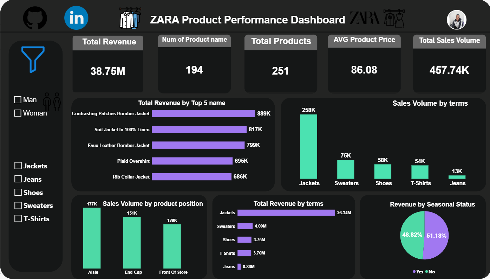

# ZARA Product Performance Analysis

## Project Overview

This project analyzes ZARA product-level data to evaluate product performance, sales volume, estimated revenue, pricing, product positioning, promotion, seasonal status, and category performance.

The project uses Excel and Power Query for data cleaning and transformation, followed by Power BI for analysis, visualization, and interactive dashboard development.

---

## Business Objective

The objective of this project is to transform product-level data into meaningful business insights that help evaluate the main drivers of product performance.

The analysis focuses on understanding:

- Which product categories generate the highest estimated revenue?
- Which products have the highest sales volume?
- Which products contribute the most to estimated revenue?
- How does product positioning relate to sales volume?
- How do promoted and non-promoted products compare?
- How do seasonal and non-seasonal products compare?
- Which categories are the main revenue drivers?
- What is the relationship between product price and sales volume?

---

## Tools Used

- Microsoft Excel
- Power Query
- Microsoft Power BI

---

## Data Cleaning & Transformation

The dataset was prepared in Excel and Power Query before being loaded into Power BI.

The main preparation steps included:

- Removing errors
- Removing blank rows
- Trimming unnecessary spaces
- Standardizing text values
- Assigning appropriate data types
- Splitting fields where required
- Creating calculated fields
- Removing unnecessary columns
- Reviewing potential outliers
- Validating the final dataset before analysis

---

## Analysis Areas

### Product Performance

- Total products
- Total sales volume
- Average product price
- Top-performing products
- Estimated revenue by product

### Product Category Analysis

- Estimated revenue by category
- Sales volume by category
- Category contribution to estimated revenue

### Product Position Analysis

- Sales volume by product position
- Estimated revenue by product position

### Promotion Analysis

- Performance comparison between promoted and non-promoted products

### Seasonal Analysis

- Revenue contribution of seasonal and non-seasonal products

---

## Key KPIs

| KPI | Definition |
|---|---|
| Estimated Revenue | Estimated product-level revenue based on sales volume and listed price |
| Total Products | Number of products in the analyzed dataset |
| Total Sales Volume | Total recorded sales volume |
| Avg. Product Price | Average listed price across products |
| Unique Product Names | Number of unique product names |

---

## Dashboard Preview

---

## Key Insights

The analysis highlights several important patterns within the dataset:

- Jackets are the dominant revenue-driving product category.
- Jackets also account for the highest sales volume among the analyzed categories.
- A small group of products contributes a significant share of estimated revenue.
- Product position shows differences in sales volume across store locations.
- Seasonal and non-seasonal products contribute relatively similar shares of estimated revenue.
- Promotional products represent a significant portion of the analyzed revenue.
- The dataset contains substantially more men's products than women's products.

---

## Important Data Interpretation

Estimated revenue in this project is derived from product-level sales volume and listed price.

Therefore, it should **not** be interpreted as ZARA's official reported revenue.

The calculation represents an analytical estimate based on the available dataset.

---

## Data Limitations

This project is based on product-level data rather than a complete transaction-level sales database.

Therefore:

- The dataset may not represent the complete ZARA product catalog.
- Estimated revenue is based on available product-level fields.
- Sales volume may not represent complete transaction-level sales.
- The dataset may have limitations related to collection time, coverage, and availability.
- The analysis should not be considered official ZARA financial reporting.

---
## Skills Demonstrated

- Data Cleaning
- Data Transformation
- Exploratory Data Analysis
- KPI Development
- Data Visualization
- Business Analysis
- Power Query
- Power BI Dashboard Development
- Data Quality Review
- Business Storytelling
---
## Author

Zahran Sayed

Data Analytics & Data Science Student
[GitHub](https://github.com/ZahranAbdelhady)

[LinkedIn](https://www.linkedin.com/in/zahransayed)
